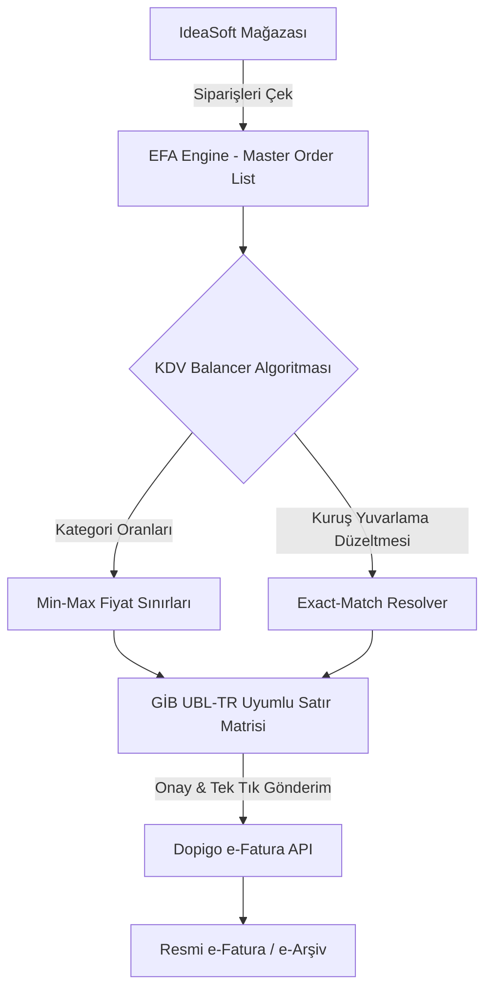

# 📊 EFA - EXlora Fatura Asistanı & KDV Balancer

<div align="center">

[](https://nextjs.org/)
[](https://reactjs.org/)
[](https://www.typescriptlang.org/)
[](https://tailwindcss.com/)
[](https://github.com/pmndrs/zustand)
[](https://ebelge.gib.gov.tr/)
[](LICENSE)

<p align="center">
  <strong>IdeaSoft e-Ticaret ve Dopigo e-Fatura Sistemleri Arasında Akıllı KDV Dağıtım ve Dengeleme Middleware Platformu</strong>
</p>

[Özellikler](#-özellikler) • [Mimari](#-sistem-mimarisi) • [Hızlı Başlangıç](#-hızlı-başlangıç) • [API & Güvenlik](#-güvenlik-ve-api-anahtarı-mimarisi) • [Kullanım](#-kullanım-rehberi) • [Lisans](#-lisans)

</div>

---

## 📖 Genel Bakış

**EFA (EXlora Fatura Asistanı)**; IdeaSoft e-ticaret altyapısı üzerindeki siparişleri çekerek, Gelir İdaresi Başkanlığı (GİB) e-Fatura / e-Arşiv mevzuatına ve UBL-TR standartlarına uygun şekilde dinamik KDV oranlarına (`%1`, `%10`, `%20`) ve belirlenen kategori sepetlerine dönüştüren, kuruş yuvarlama hatalarını sıfırlayan akıllı bir fatura dengeleme motorudur.

Dopigo e-Fatura entegratörü ile çift yönlü çalışan EFA; sipariş tutarlarını belirlediğiniz kategori yüzdelerine, min/max birim fiyat limitlerine göre kuruşu kuruşuna (%100.00) dengeleyerek tek tıkla e-Fatura oluşturmanızı sağlar.

---

## ✨ Özellikler

### 🎯 1. Matematiksel Exact-Match KDV Dağıtım Motoru
- **0.00 TL Sapma Garantisi:** Toplam sipariş tutarını sepet içerisindeki kategori yüzdelerine (`%50 Tekstil`, `%30 Aksesuar`, `%20 Toka` vb.) dağıtır.
- **Kuruş Dengeleme (Penny Balancing):** Küsürat ve kuruş farklarını son kalemde otomatik absorbe ederek fatura dip toplamını tam olarak sipariş tutarına eşitler.
- **GİB UBL-TR Standart Bütünlüğü:** Her satırda `Miktar × Birim Fiyat === Satır Toplamı` formülünü kati suretle korur; GİB şema doğrulama hatalarını engeller.

### 🔌 2. Çift Yönlü API Entegrasyonu & Doğrulama
- **IdeaSoft API:** Siparişleri canlı olarak çeker, durum filtrelemesi yapar.
- **Dopigo e-Fatura API:** Dengelenmiş fatura satırlarını anında Dopigo üzerinden e-Arşiv / e-Fatura olarak keser.
- **Kademeli Doğrulama (Granular Verification):** IdeaSoft ve Dopigo anahtarlarını ayrı ayrı test eder, hata kaynağını anında gösterir.

### 🏷️ 3. Özel Kategori & KDV Yönetimi
- Sınırsız sayıda özel kategori, KDV oranı (`%1`, `%10`, `%20`), hedef dağılım yüzdesi ve min-max birim fiyat tanımlama.
- Yüzde toplamını `%100` normalize eden akıllı arayüz uyarıları.

### 🛡️ 4. Sıfır Sızıntı & İstemci Taraflı Güvenlik
- API anahtarlarınız **asla harici sunucu veritabanlarında saklanmaz**.
- Tüm kimlik bilgileri kullanıcının kendi tarayıcısındaki `localStorage` alanında izole tutulur.
- `.env` ve `.env.local` dosyaları `.gitignore` ile repo dışı bırakılmıştır.

---

## 🏗️ Sistem Mimarisi



---

## 🔒 Güvenlik ve API Anahtarı Mimarisi

> [!IMPORTANT]
> **GitHub'dan Projeyi İndiren Kişilerde API Anahtarları Nasıl Davranır?**
>
> 1. **Kutular Tamamen Boş Gelir:** Projeyi GitHub üzerinden indiren veya klonlayan bir kullanıcının `Ayarlar` sayfasındaki `IdeaSoft Client ID`, `Client Secret` ve `Dopigo API Token` kutuları **tamamen BOŞTUR**.
> 2. **Sıfır Key Sızıntısı:** Kod tabanında hardcoded (sabit kodlanmış) hiçbir gizli anahtar bulunmaz.
> 3. **İstemci Taraflı İzolasyon (`localStorage`):** Kaydettiğiniz tüm anahtarlar yalnızca sizin kendi tarayıcınızın yerel depolama alanında (`efa_vat_api_settings`) saklanır.
> 4. **Git Koruması:** `.gitignore` dosyası tüm `.env*` dosyalarını kapsamaktadır; yerel ortam değişkenleriniz GitHub'a asla yüklenmez.

---

## 🚀 Hızlı Başlangıç

### Gereksinimler
- **Node.js:** v18.18.0 veya üzeri (v20+ önerilir)
- **npm**, **yarn**, **pnpm** veya **bun**

### 1. Depoyu Klonlayın
```bash
git clone https://github.com/mehmetaltundere/vat-invoice-balancer.git
cd vat-invoice-balancer
```

### 2. Bağımlılıkları Yükleyin
```bash
npm install
# veya
pnpm install
# veya
yarn install
```

### 3. Geliştirme Sunucusunu Başlatın
```bash
npm run dev
```

Tarayıcınızda **[http://localhost:3000](http://localhost:3000)** adresine gidin.

---

## ⚙️ Yapılandırma ve Kurulum

1. Uygulama arayüzünde sol menüden **Ayarlar** (`/settings`) sayfasına gidin.
2. **IdeaSoft API Bilgileri:**
   - `Client ID` ve `Client Secret` değerlerinizi girin.
3. **Dopigo API Bilgileri:**
   - `Dopigo API Token` bilginizi girin.
4. **Kategorileri Tanımlayın:**
   - Faturada dağıtılacak ürün kategorilerini, KDV oranlarını (`%1`, `%10`, `%20`), hedef yüzdeleri ve minimum/maksimum birim fiyat sınırlarını belirleyin.
5. **Doğrula ve Kaydet** butonuna tıklayın.

---

## 📂 Proje Dizin Yapısı

```text
vat-invoice-balancer/
├── app/                        # Next.js App Router sayfaları & API rotaları
│   ├── api/                    # Sunucu tarafı API Proxy & Doğrulama rotaları
│   │   ├── dopigo/             # Dopigo entegrasyon uç noktaları
│   │   └── ideasoft/           # IdeaSoft sipariş & doğrulama uç noktaları
│   ├── ayarlar/ & settings/    # API & KDV Kategori yönetim sayfaları
│   ├── fatura-kes/ & invoice/  # Canlı fatura dengeleme & gönderim motoru
│   ├── globals.css             # Tailwind v4 stil tanımları
│   ├── layout.tsx              # Ana uygulama kabuğu (Sidebar & Topbar)
│   └── page.tsx                # Dashboard ana sayfası
├── components/                 # Modüler React UI Bileşenleri
│   ├── dashboard/              # Özet istatistik kartları & sistem sağlık göstergesi
│   ├── invoice/                # Sipariş listesi, KDV dengeleme ve GİB seçicisi
│   ├── layout/                 # Sidebar ve üst gezinme çubuğu
│   ├── settings/               # API ayar formları ve dinamik kategori formu
│   └── ui/                     # Kart, buton, input, toast ve badge bileşenleri
├── hooks/                      # Custom React Hook'ları (useApiSettings vb.)
├── lib/                        # Güvenlik, doğrulama, store ve yardımcı fonksiyonlar
│   ├── security/               # Zod şemaları ve girdi sanitizasyonu
│   └── store/                  # Zustand global state (useInvoiceStore)
├── services/                   # İş mantığı servisleri
│   ├── balancer.ts             # Matematiksel exact-match dengeleme algoritması
│   ├── dopigo.ts               # Dopigo API istemcisi
│   └── ideasoft.ts             # IdeaSoft API istemcisi
└── public/                     # Statik görsel ve ikon varlıkları
```

---

## 🧮 KDV Balancer Algoritması Nasıl Çalışır?

Fatura dengeleme motoru şu aşamalardan geçer:

1. **Hedef Tutar Ayrımı:** Sipariş toplamı kategorilerin hedef yüzdelerine göre paylaştırılır.
   $$\text{Kategori Tutarı} = \text{Toplam Sipariş} \times \frac{\text{Hedef Yüzde}}{100}$$
2. **Miktar & Birim Fiyat Optimizasyonu:** Kategori min/max fiyat aralığında optimal adet ve birim fiyat türetilir.
3. **Kuruş Eşitleme (Penny Rounding Adjustment):** KDV matrahlarındaki kayan nokta (floating point) kuruş farkları son kategoriye aktarılarak:
   $$\sum \text{Satır Tutarları} = \text{Orijinal Sipariş Tutarı} \quad (\Delta = 0.00 \text{ TL})$$
4. **GİB Doğrulaması:** Her satır `Birim Fiyat × Miktar = Satır Toplamı` formülüne kesin olarak kilitlenir.

---

## 🛠️ Komutlar

| Komut | Açıklama |
| :--- | :--- |
| `npm run dev` | Turbopack ile yerel geliştirme sunucusunu başlatır (`localhost:3000`) |
| `npm run build` | Üretim (Production) derlemesini oluşturur |
| `npm run start` | Derlenmiş üretim sunucusunu çalıştırır |
| `npm run lint` | ESLint ile kod kalitesi ve stil kontrollerini yürütür |

---

## 📄 Lisans

Bu proje **[MIT Lisansı](LICENSE)** altında lisanslanmıştır. Detaylar için lisans dosyasına göz atabilirsiniz.
