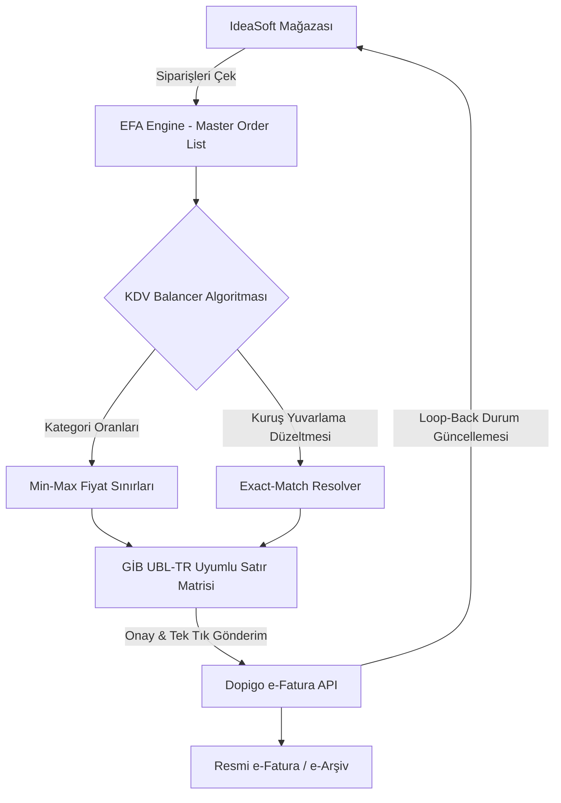
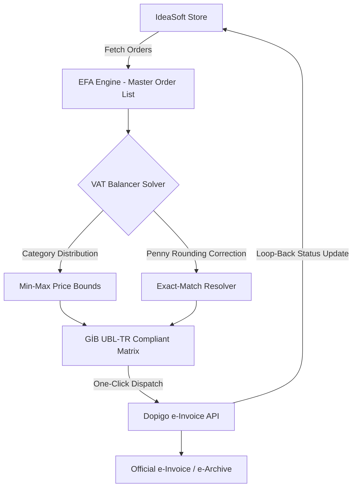

# 📊 EFA - EXlora Fatura Asistanı & KDV Balancer
### *EFA - Smart VAT Balancing & e-Invoice Middleware Platform*

<div align="center">

[](https://nextjs.org/)
[](https://reactjs.org/)
[](https://www.typescriptlang.org/)
[](https://tailwindcss.com/)
[](https://v2.tauri.app/)
[](https://github.com/pmndrs/zustand)
[](https://ebelge.gib.gov.tr/)

<p align="center">
  <strong>IdeaSoft e-Ticaret ve Dopigo e-Fatura Sistemleri Arasında Akıllı KDV Dağıtım ve Dengeleme Middleware Platformu</strong><br/>
  <em>Intelligent VAT Distribution & e-Invoice Balancing Middleware between IdeaSoft e-Commerce and Dopigo e-Invoice APIs</em>
</p>

🌐 **[Türkçe Dokümantasyon](#-türkçe-dokümantasyon)** | 🌐 **[English Documentation](#-english-documentation)**

</div>

---

# 🇹🇷 Türkçe Dokümantasyon

## 📖 Genel Bakış

**EFA (EXlora Fatura Asistanı)**; IdeaSoft e-ticaret altyapısı üzerindeki siparişleri çekerek, Gelir İdaresi Başkanlığı (GİB) e-Fatura / e-Arşiv mevzuatına ve UBL-TR standartlarına uygun şekilde dinamik KDV oranlarına (`%1`, `%10`, `%20`) ve belirlenen kategori sepetlerine dönüştüren, kuruş yuvarlama hatalarını sıfırlayan akıllı bir fatura dengeleme motorudur.

Dopigo e-Fatura entegratörü ile çift yönlü çalışan EFA; sipariş tutarlarını belirlediğiniz kategori yüzdelerine, min/max birim fiyat limitlerine göre kuruşu kuruşuna (%100.00) dengeleyerek tek tıkla e-Fatura oluşturmanızı sağlar.

---

## ✨ Özellikler

### 🎯 1. Matematiksel Exact-Match KDV Dağıtım Motoru
- **0.00 TL Sapma Garantisi:** Toplam sipariş tutarını sepet içerisindeki kategori yüzdelerine (`%50 Tekstil`, `%30 Aksesuar`, `%20 Toka` vb.) dağıtır.
- **Kuruş Dengeleme (Penny Balancing):** Küsürat ve kuruş farklarını son kalemde otomatik absorbe ederek fatura dip toplamını tam olarak sipariş tutarına eşitler.
- **GİB UBL-TR Standart Bütünlüğü:** Her satırda `Miktar × Birim Fiyat === Satır Toplamı` formülünü kati suretle korur; GİB şema doğrulama hatalarını engeller.

### 🔌 2. Çift Yönlü API Entegrasyonu & Doğrulama
- **IdeaSoft API:** Siparişleri canlı olarak çeker, durum filtrelemesi yapar.
- **Dopigo e-Fatura API:** Dengelenmiş fatura satırlarını anında Dopigo üzerinden e-Arşiv / e-Fatura olarak keser.
- **Kademeli Doğrulama (Granular Verification):** IdeaSoft ve Dopigo anahtarlarını ayrı ayrı test eder, hata kaynağını anında gösterir.
- **Loop-Back Güncelleme:** Fatura kesildiğinde IdeaSoft sipariş durumu anında "Faturalandırıldı" olarak güncellenir.

### 🏷️ 3. Özel Kategori & KDV Yönetimi
- Sınırsız sayıda özel kategori, KDV oranı (`%1`, `%10`, `%20`), hedef dağılım yüzdesi ve min-max birim fiyat tanımlama.
- Yüzde toplamını `%100` normalize eden akıllı matematik kilidi (`Math Lock`).
- Aksan duyarsız Türkçe arama normalizasyonu (`"gozluk"` -> `"Gözlük"`).

### 🖥️ 4. Masaüstü Uygulama Desteği (Tauri v2)
- Web arayüzünün yanı sıra Windows `.exe` / `.msi` masaüstü uygulaması olarak paketlenebilir.
- OTA (Over-The-Air) otomatik güncelleme altyapısı hazır.

### 🛡️ 5. Sıfır Sızıntı & İstemci Taraflı Güvenlik
- API anahtarlarınız **asla harici sunucu veritabanlarında saklanmaz**.
- Tüm kimlik bilgileri kullanıcının kendi tarayıcısındaki `localStorage` alanında (`efa_vat_api_settings`) izole tutulur.
- `.env` ve `.env.local` dosyaları `.gitignore` ile repo dışı bırakılmıştır.

---

## 🏗️ Sistem Mimarisi



---

## 🚀 Hızlı Başlangıç

### Gereksinimler
- **Node.js:** v18.18.0 veya üzeri (v20+ önerilir)
- **npm**, **yarn**, **pnpm** veya **bun**

### 1. Depoyu Klonlayın
```bash
git clone https://github.com/mehmetaltundere/vat-invoice-balancer.git
cd vat-invoice-balancer
```

### 2. Bağımlılıkları Yükleyin
```bash
npm install
```

### 3. Geliştirme Sunucusunu Başlatın
```bash
npm run dev
```

Tarayıcınızda **[http://localhost:3000](http://localhost:3000)** adresine gidin.

### 4. Masaüstü (.exe) Derleme (Tauri v2)
```bash
npm run build
npx @tauri-apps/cli build
```

---

# 🇬🇧 English Documentation

## 📖 Overview

**EFA (EXlora Invoice Assistant)** is an enterprise-grade middleware and VAT balancing engine designed to bridge **IdeaSoft e-Commerce** and **Dopigo e-Invoice** platforms. It fetches e-commerce orders and intelligently distributes their totals across custom product category buckets with varying VAT rates (`1%`, `10%`, `20%`) while strictly preserving Turkish Revenue Administration (GİB) e-Invoice and UBL-TR XML compliance.

With zero penny rounding deviations ($\Delta = 0.00$), EFA eliminates arithmetic floating-point rounding mismatches and empowers accounting teams to automate high-volume e-invoice creation in single or batch modes with one-click execution.

---

## ✨ Key Features

### 🎯 1. Exact-Match Mathematical VAT Balancing Engine
- **Zero Delta Guarantee ($\Delta = 0.00$):** Splits order totals according to user-defined category ratios (`e.g., 50% Textile`, `30% Accessories`, `20% Hairpins`).
- **Penny Absorber:** Automatically absorbs floating-point fractional remainders into the final line item so that the calculated total precisely matches the original customer payment.
- **GİB UBL-TR Line Integrity:** Strictly enforces `Quantity × UnitPrice === LineTotal` on every invoice row to avoid schema rejection by government tax portals.

### 🔌 2. Two-Way API Bridge & Granular Verification
- **IdeaSoft Integration:** Real-time order fetching, status filtering, and corporate vs. personal TCKN separation.
- **Dopigo e-Invoice Integration:** Immediate generation and dispatch of official e-Archive / e-Invoice documents.
- **Granular API Diagnostics:** Independently validates IdeaSoft and Dopigo credentials step-by-step with visual badges (✅ / ❌) and explicit error toasts.
- **Order Status Loop-Back:** Automatically updates IdeaSoft order status to **"Invoiced"** (`BALANCED`) upon successful dispatch.

### 🏷️ 3. Custom Category & Matrix Configuration
- Define custom categories with specific VAT rates (`1%`, `10%`, `20%`), target distribution percentages, and unit price `[min, max]` boundaries.
- **Math Lock Protection:** Prevents invoice generation if category target percentages do not sum exactly to `100.00%`.
- **Turkish Accent Normalization:** Search without accent barriers (`"gozluk"` effortlessly matches `"Güneş Gözlüğü"`).

### 🖥️ 4. Native Desktop Packaging (Tauri v2)
- Fully configured Next.js static export (`output: 'export'`) optimized for Windows `.exe` / `.msi` desktop binaries.
- Over-The-Air (OTA) automated updater support via GitHub Releases (`tauri-plugin-updater`).

### 🛡️ 5. Zero-Leakage Client-Side Security
- **No Remote Database Storage:** API keys and credentials are never stored on intermediate cloud databases.
- **Local Storage Isolation:** Credentials persist strictly inside the user's local browser storage (`efa_vat_api_settings`).
- **Clean Repo Policy:** All `.env` and `.env.local` files are ignored by git; cloning the repo produces clean, unpolluted empty input fields.

---

## 🏗️ System Architecture



---

## 🧮 Mathematical Solver: How It Works

The Exact-Match resolver performs the following discrete optimization:

1. **Target Subtotal Partitioning:**
   $$\text{Subtotal}_k = \text{Order Total} \times \frac{\text{Target Percent}_k}{100}$$

2. **Quantity and Unit Price Derivation:**
   Within the category price bounds $[\text{MinPrice}_k, \text{MaxPrice}_k]$, an optimal discrete quantity $q_k \ge 1$ and unit price $p_k$ are generated.

3. **Penny Discrepancy Absorption:**
   Any fractional rounding remainder is absorbed into the final line $n$:
   $$\text{Subtotal}_n = \text{Order Total} - \sum_{i=1}^{n-1} \text{Subtotal}_i$$
   Ensuring:
   $$\sum_{i=1}^{n} \text{Subtotal}_i \equiv \text{Order Total} \quad (\Delta = 0.00)$$

4. **XML Multiplication Guard:**
   The final line is strictly bound by $q_n = 1$ and $p_n = \text{Subtotal}_n$ guaranteeing that $q_n \times p_n = \text{Subtotal}_n$ without single-penny rounding mismatch in UBL-TR XML validators.

---

## 🚀 Quick Start Guide

### Prerequisites
- **Node.js:** v18.18.0 or higher (v20+ LTS recommended)
- **Package Manager:** `npm`, `pnpm`, `yarn`, or `bun`
- **Optional for Desktop Build:** Rust toolchain (`rustup` / `cargo`)

### 1. Clone the Repository
```bash
git clone https://github.com/mehmetaltundere/vat-invoice-balancer.git
cd vat-invoice-balancer
```

### 2. Install Dependencies
```bash
npm install
```

### 3. Start Development Server
```bash
npm run dev
```
Open **[http://localhost:3000](http://localhost:3000)** in your browser.

### 4. Build Desktop Binary (.exe / .msi)
```bash
npm run build
npx @tauri-apps/cli build
```
The compiled standalone Windows installer will be available at:
`src-tauri/target/release/bundle/nsis/EFA_0.1.0_x64-setup.exe`

---

## ⚙️ Initial Configuration

1. Navigate to **Settings** (`/settings`) from the left sidebar.
2. Enter your **IdeaSoft API Credentials** (`Client ID` and `Client Secret`).
3. Enter your **Dopigo API Token**.
4. Configure your preferred VAT categories, tax percentages (`%1`, `%10`, `%20`), and target percentages summing to `100%`.
5. Click **"Doğrula ve Kaydet" (Verify & Save)**. The system will sequentially validate both APIs before saving credentials to secure local storage.

---

## 📂 Repository Directory Structure

```text
vat-invoice-balancer/
├── app/                        # Next.js 16 App Router pages & API routes
│   ├── api/                    # Server-side proxy & validation endpoints
│   │   ├── dopigo/             # Dopigo invoice dispatch & token verification
│   │   └── ideasoft/           # IdeaSoft order ingestion & status loop-back
│   ├── invoice/                # Two-pane VAT balancing & invoice generation UI
│   ├── settings/               # Granular API configuration & custom VAT category manager
│   ├── layout.tsx              # App Shell (Deep Slate Sidebar & Clean Topbar)
│   └── page.tsx                # Dashboard metrics & live order overview
├── components/                 # Reusable React components (Tailwind v4)
│   ├── dashboard/              # Stat cards, recent orders table & system health
│   ├── invoice/                # Master order list, range resolver & GİB combobox
│   ├── layout/                 # Sidebar (Dark #0F172A) & Topbar
│   └── settings/               # API settings form & dynamic category creator
├── hooks/                      # Custom hooks (useApiSettings)
├── lib/                        # Security sanitizers, global Zustand store & utilities
│   ├── security/               # Zod input schemas & XSS validation
│   ├── services/               # Granular cloud VAT database definitions
│   └── store/                  # Zustand persistent store (useInvoiceStore)
├── services/                   # Core business logic & balancing math solver
│   └── balancer.ts             # Exact-match penny solver algorithm
├── src-tauri/                  # Tauri v2 Windows desktop configuration & Rust backend
└── public/                     # Brand logos (isimhalilogo.png, logosembol.png)
```

---

## 🛠️ CLI Scripts

| Command | Description |
| :--- | :--- |
| `npm run dev` | Starts local Next.js development server with Turbopack (`localhost:3000`) |
| `npm run build` | Compiles production static export bundle (`out/` directory for Tauri) |
| `npm run start` | Starts Node.js production server |
| `npm run lint` | Executes ESLint code quality and type checks |
| `npx @tauri-apps/cli build` | Compiles native Windows desktop `.exe` / `.msi` standalone package |

---

## 📄 License & Attribution

Developed by **EXlora Systems** & **Mehmet Altundere**.  
Copyright © 2026 EFA - EXlora Fatura Asistanı. All rights reserved.
